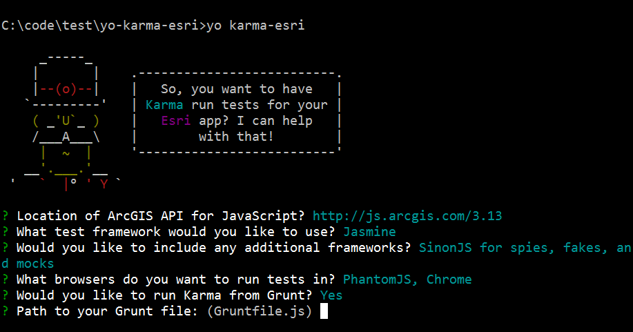

# generator-karma-esri [](https://travis-ci.org/tomwayson/generator-karma-esri)

> A [Yeoman](http://yeoman.io) generator to configure [Karma] to run unit tests to your [ArcGIS API for JavaScript] application

See [my tutorial] for more on running unit tests with Karma in ArcGIS API for JavaScript apps.

## Getting Started

Install [Yeoman] (if you haven't already)

```bash
npm install -g yo
```

To install generator-karma-esri from npm, run:

```bash
npm install -g generator-karma-esri
```

Finally, initiate the generator:

```bash
yo karma-esri
```
Answer the man's questions. When in doubt, you'll probably be safe with the defaults.



## Running Tests with Karma

After running the generator you'll want to tell Karma where your source code and test spec files can be found. Open karma.config.js and update the `files` section with the paths where those files can be found. Be sure to set `included:false` since these will be loaded by Dojo's AMD loader. For example:
```js
    // list of files / patterns to load in the browser
    files: [
      // karma and dojo config
      'test/config.js',
      // source code
      { pattern: 'app/**/*.js', included:false },
      // test specs
      { pattern: 'test/spec/**/*.js', included:false }
    ],
```

After that you can run Karma with:
```bash
karma start
```

See [my tutorial] for more on running unit tests with Karma in ArcGIS API for JavaScript apps.

## License

Apache

[Karma]: http://karma-runner.github.io/
[ArcGIS API for JavaScript]: https://developers.arcgis.com/javascript/
[my tutorial]: https://github.com/tomwayson/esri-karma-tutorial
